# Wireless Security Assessment Lab Series

## Objective
Completed nine controlled wireless-security labs spanning discovery, WPA/WPA2 handshake capture, password auditing, rogue access points, WPS testing, MITM analysis, and automated assessment.

### Skills Learned
- Enabled monitor mode and inventoried SSIDs, BSSIDs, channels, clients, and encryption.
- Captured WPA/WPA2 handshakes and tested dictionary-based recovery.
- Simulated evil-twin, WPS, and MITM scenarios in a lab environment.
- Detected suspicious or duplicate access points and compared manual versus automated auditing.

### Tools Used
- Aircrack-ng
- Airmon-ng
- Airodump-ng
- Aireplay-ng
- Wifiphisher
- Reaver
- Kismet
- Hashcat
- Bettercap
- Wifite2

## Steps

*Ref 1: Airodump-ng captured WPA handshake evidence for the target NETHUB LR access point, including BSSID, channel, encryption, connected clients, and EAPOL frame activity.*

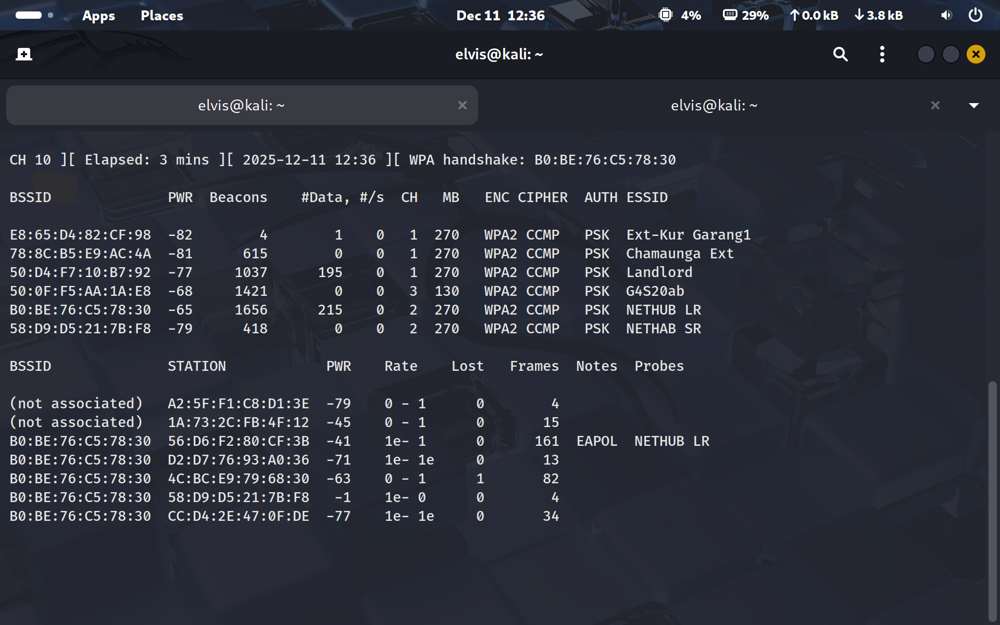

*Ref 2: Aireplay-ng deauthentication traffic was used in the controlled lab to force client reassociation and trigger a fresh WPA handshake capture.*

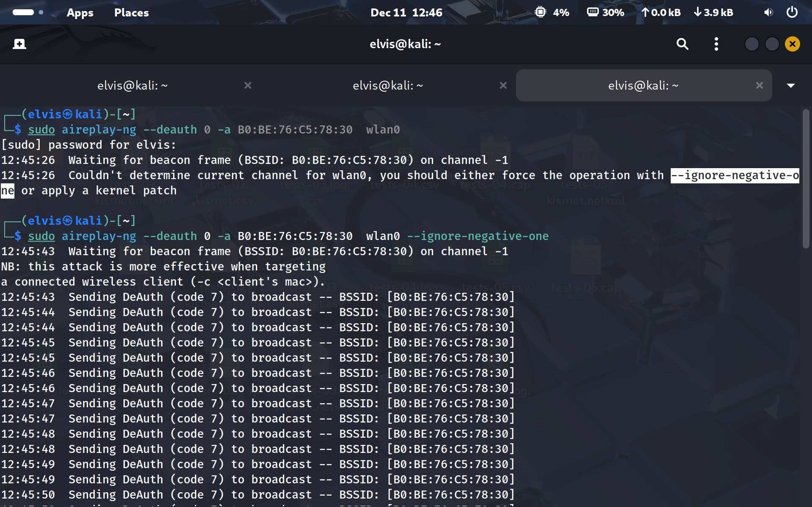

*Ref 3: Wireshark analysis filtered the capture to EAPOL frames, confirming the WPA four-way handshake packets were present for the target client and AP.*

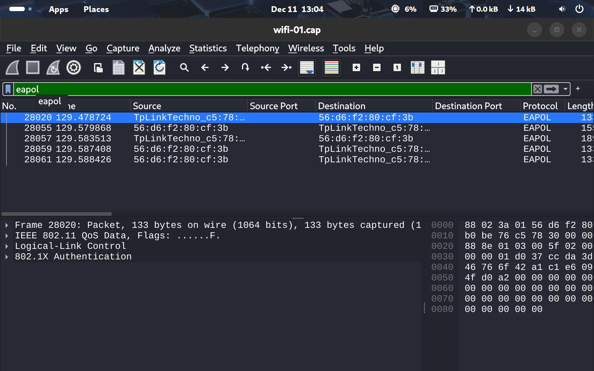

*Ref 4: Airodump-ng reconnaissance showed nearby WPA2 access points, active stations, channels, signal strength, and packet counts used to validate target selection.*

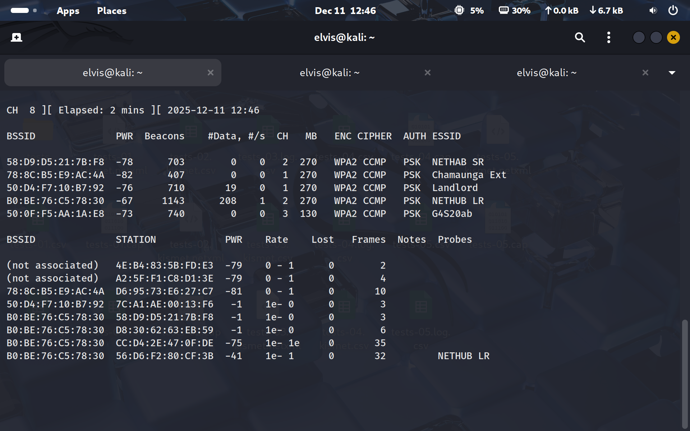

*Ref 5: Aircrack-ng completed a dictionary-based password audit against the captured handshake and recovered the lab network key.*

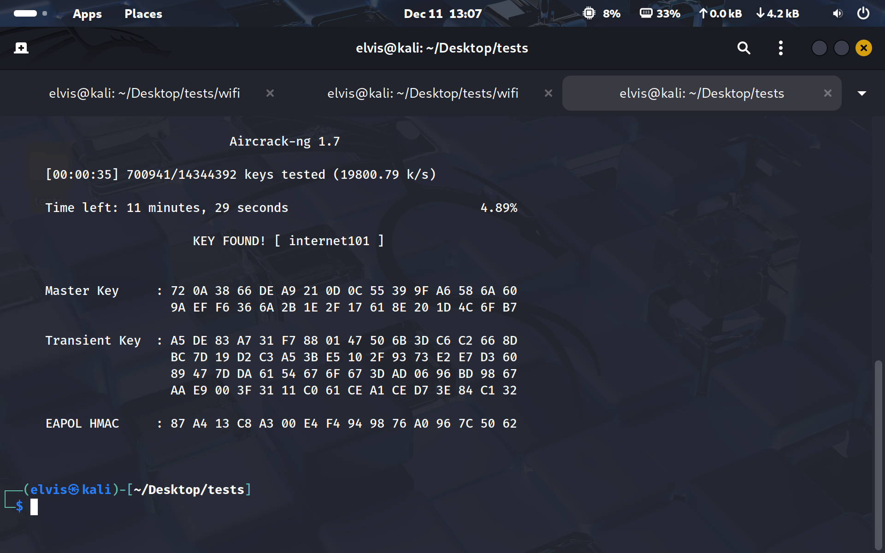

*Ref 6: Wifiphisher enumerated nearby access points with BSSID, channel, encryption, WPS status, client count, and vendor details before selecting the lab target.*

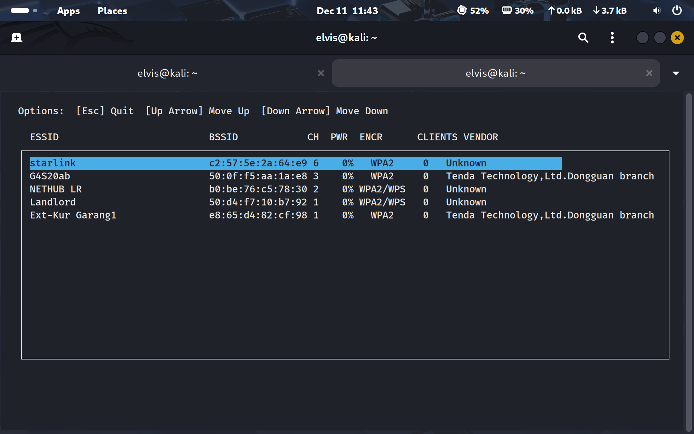

*Ref 7: Wifiphisher ran the controlled rogue access point scenario, showing a connected lab client, captive-portal HTTP requests, and the submitted test credential.*

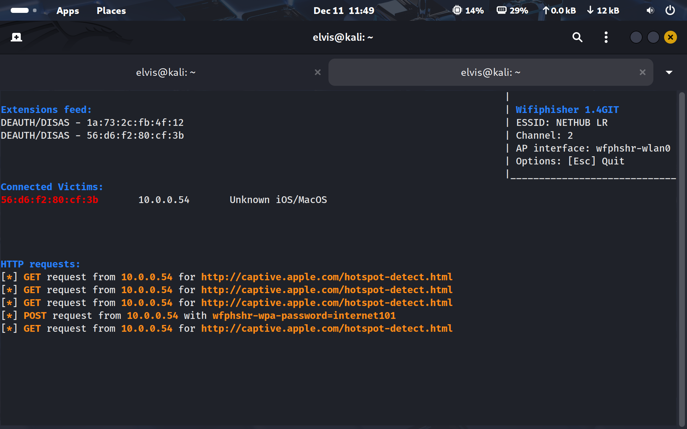

*Ref 8: Reaver WPS testing targeted a selected access point, received beacon frames, attempted PIN authentication, and recorded repeated receive-timeout warnings.*

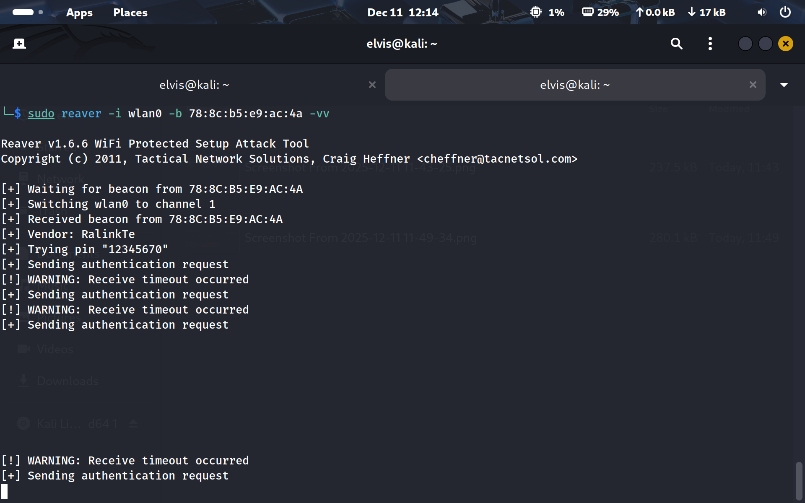

*Ref 9: Kismet provided a browser-based wireless inventory with detected APs, encryption types, channels, packet activity, signal levels, and manufacturer data.*

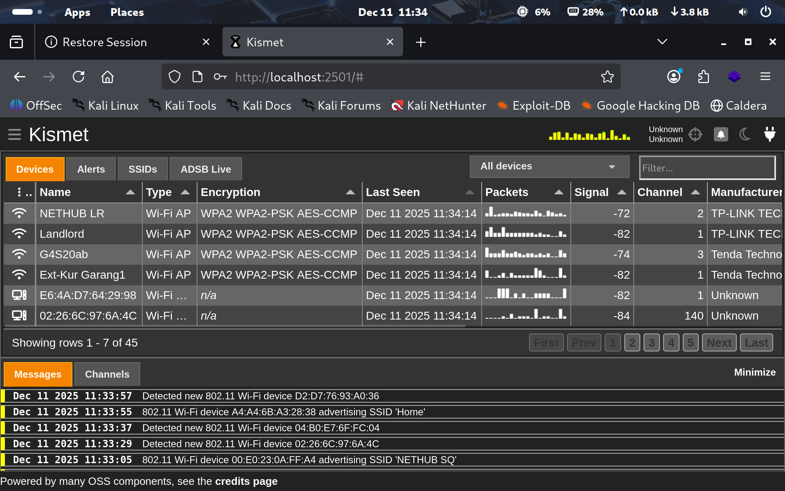

*Ref 10: Aircrack-ng converted the captured WPA handshake into Hashcat-compatible format and identified the NETHUB LR handshake as the cracking target.*

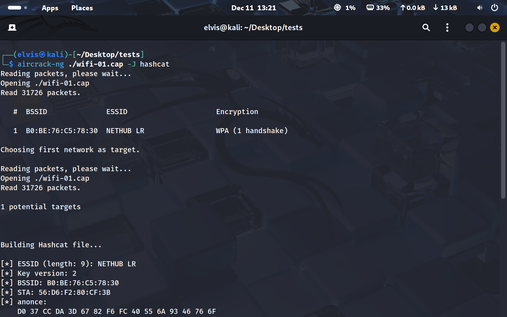

*Ref 11: Hashcat completed the WPA-PBKDF2 audit in mode 22000, marked the hash as cracked, and reported the recovered lab PSK.*

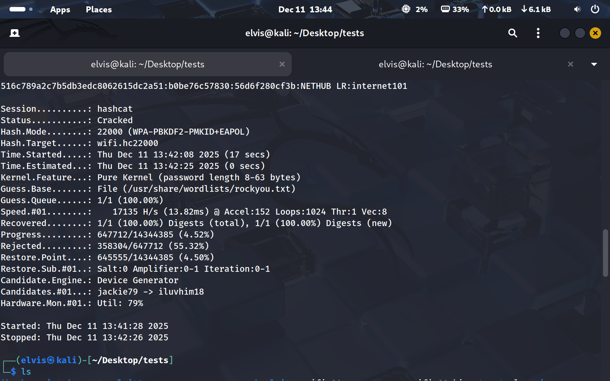

*Ref 12: Bettercap wireless reconnaissance started on wlan0, enabled channel hopping, and logged newly discovered access points and client probe activity.*

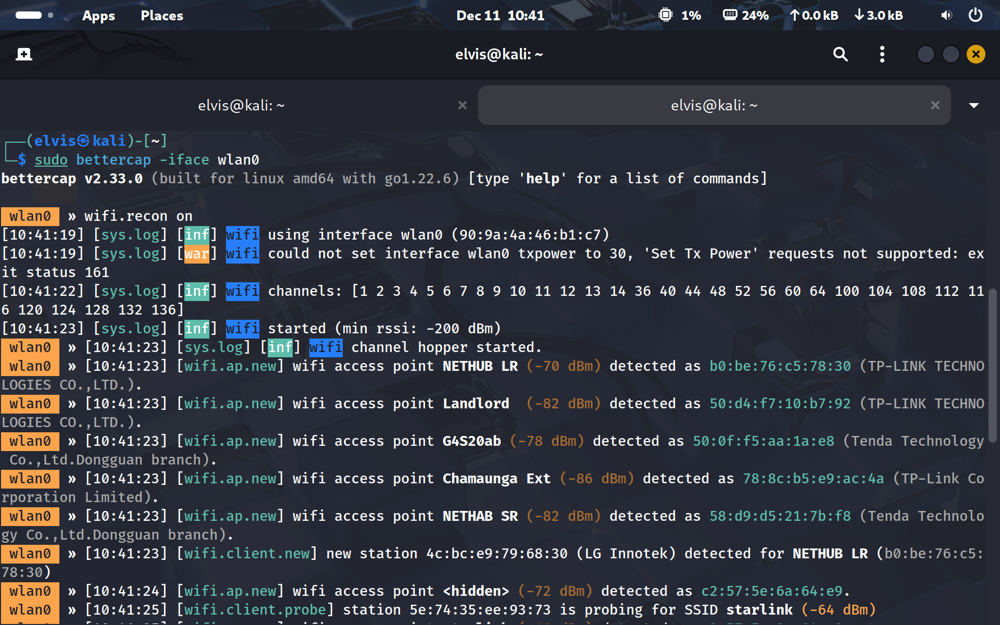

*Ref 13: Bettercap wifi.show summarized discovered networks by RSSI, BSSID, SSID, encryption, WPS version, channel, client count, and observed traffic.*

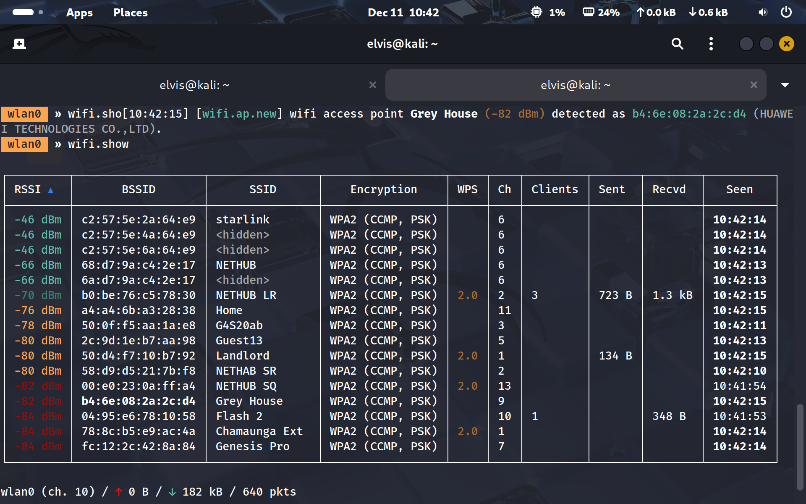

*Ref 14: Bettercap net.sniff captured live 802.11 management beacon frames, showing transmitter and receiver addresses for observed wireless networks.*

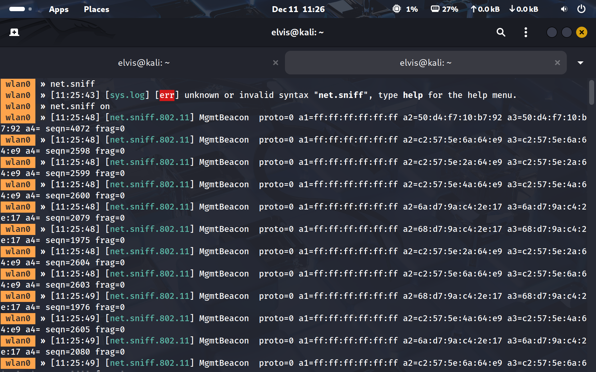

*Ref 15: Wifite2 enumerated wireless targets in monitor mode, highlighting ESSID, channel, encryption type, signal strength, WPS availability, and client presence.*

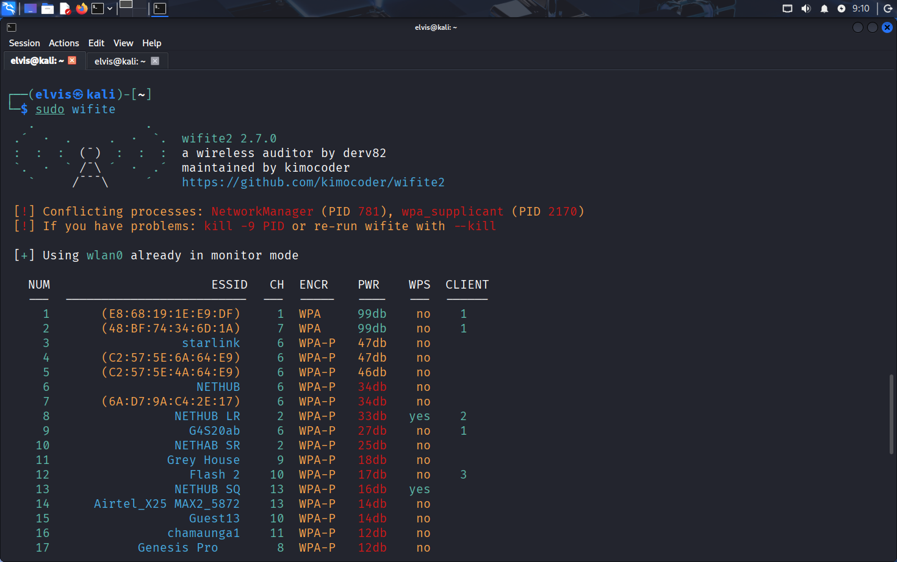

*Ref 16: Wifite2 captured and validated a WPA handshake, ran a wordlist audit, saved the evidence file, and recorded the recovered test PSK in the results output.*

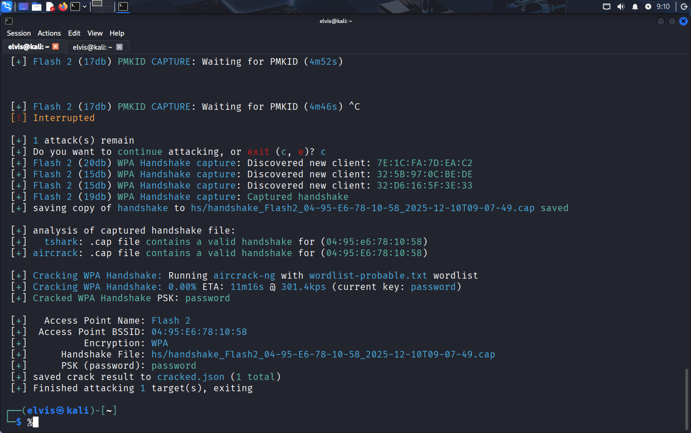
